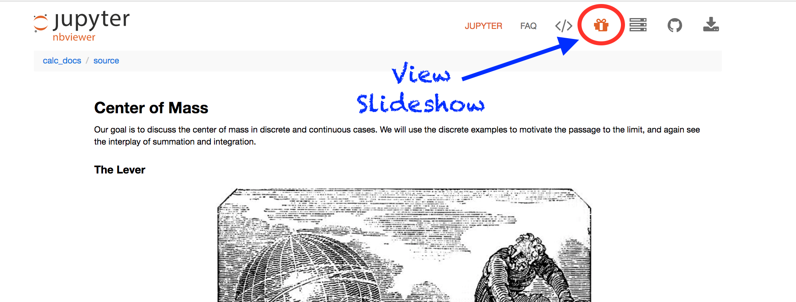
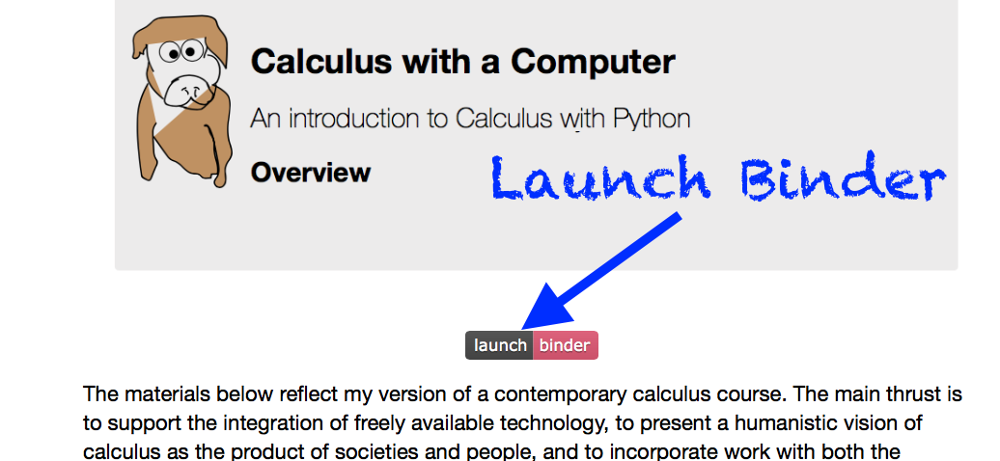
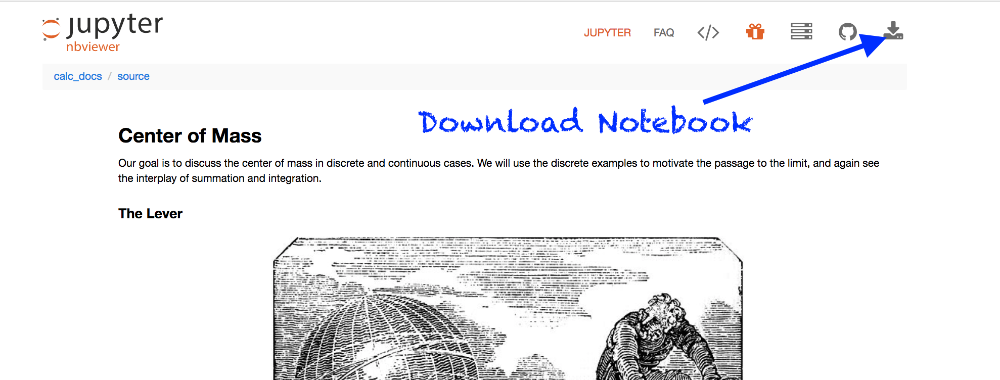

    
       

            
 $~$ 

    <h1>Calculus with a Computer</h1>
    An introduction to Calculus with Python 

       

The materials below reflect my version of a contemporary calculus course.  The main thrust is to support the integration of freely available technology, to present a humanistic vision of calculus as the product of societies and people, and to incorporate work with both the discrete and continuous with attention to statistics and data analysis.

---

**A Note on Structure of Materials**

While I have constructed these materials using the Python computer language and Jupyter notebooks, I've relegated the code and computer based solutions to the end of the notebooks.  By using the Jupyter notebooks, I am able to quickly represent and solve problems.  I am also able to build slideshows and host these through `nbviewer`.  

- **Slideshows**: To view the slideshow of a given notebook click the slideshow button on the `nbviewer` toolbar.

- **Interacting with Notebooks**: I've place links to launch the notebooks using Binder.  This will allow you to interact with and alter the notebook online, however your work will not be saved.  Simply click the `Binder` button at the top of the notebook, wait while the notebook is created, and you may use the notebook interactively online.

- **Downloading the Notebooks**: Download and install Anaconda on your computer.  Use the **download** button on the `nbviewer` toolbar.

### Section I: Integration

This section introduces classical problems in calculus through the definite integral.  We deal with both finite and continuous domains, comparing approximations and exact answers involving the integral as an accumulator.  The focus is on the infinite process as a problem solving strategy, and developing facility using definite integrals to solve specific problems.

- [Problematic Numbers](0.1_calc_Intro_to_Infinite.ipynb): Introducing the infinite process through approximating square roots and $\pi$

- [Approximating Areas I](0.2_calc_summations_and_areas.ipynb): Approximating areas using rectangles.

- [Approximating Areas II](0.3_calc_area_approxII.ipynb): Approximating using Trapezoids and Parabolas.

- [Cardiac Output](0.4_calc_measuring_cardiac_output.ipynb): Application of approximation to Biology.

- [The Definite Integral ](0.5_calc_definite_integral.ipynb): Moving to a basic definition for a definite integral and exact solutions to the area problem.

**PROJECTS**

- [Work and Force in Physics](0.6_calc_work_force.ipynb)

- [Centers of Mass in Physics](0.7_calc_centers_of_mass.ipynb)

- [Consumer and Producer Surplus in Economics](0.8_calc_consumer_surplus.ipynb)

- [Probability Distributions and Statistics](0.9_calc_probability_stats.ipynb)

### Section II: Differentiation

Motivated by classical problems of motion, we begin to investigate the concept of derivatives.  Problems involving approximate and exact solutions in motion give way to geometric interpretations of the tangent line.  We examine applications of optimization to game theory and equation solving.

- [Mathematizing Motion](1.0_calc_motion.ipynb)

- [Defining a Derivative](1.1_calc_derivatives.ipynb)

- [Derivatives: Maximum and Minimum Values](1.2_calc_maxmin.ipynb)

- [Applications: Nash Arbitration Scheme](1.3_calc_gametheory.ipynb)

- [Chain Rule and Parametric Descriptions](1.4_calc_chainrule.ipynb)

- [Derivatives: Solving Equations with Newton's Method](1.5_calc_newtons_method.ipynb)

**PROJECTS**

- [Projectile Motion and Differentiation](1.5_calc_projectiles.ipynb)

- [Parametrics and Interpolation](1.6_calc_interpolation.ipynb)

- [Least Squares Methods and Statistics](1.7_calc_regression.ipynb)

- [Newton's Method and Chaos](1.8_calc_newtonchaos.ipynb)

### Section III: Differential Equations

Here, we introduce differential equations through a variety of applications.  Qualitative solutions and phase plane analysis, Euler's method and Runge Kutta approximations, and basic separation of variables problems are discussed.  Using population models, we connect the earlier work with the dynamics of Newton's method.

- [Modeling Populations: Exponential vs. Logistic Growth](2.0_calc_populations.ipynb)

- [Phase Plane Analysis: Qualitative Methods and the Lotka - Volterra model.](2.1_calc_phaseplane.ipynb)

- [Fixed Points and Stability - Some Applications](2.3_calc_fixedpoints.ipynb)

- [Approximating Solutions: Euler and Runge-Kutta](2.4_calc_approx.ipynb)

**PROJECTS**

- [Dynamical Sytems and Biology](2.5_calc_aqua.ipynb)

- [Classical Problems from Differential Equations](2.6_brachist.ipynb)

- [Physics of Waves](2.7_calc_waves.ipynb)

### Final Projects

Students produce a final piece of work that applies our work in Calculus with deeper problems depending on their interests.

- [Gender, Craft, Calculus](3.0_calc_computing.ipynb)

- [Statistics and Calculus](3.1_stats_and_calc.ipynb)

- [Historical Problems in Calculus](3.2_calc_history.ipynb)

- [Non - Linear Systems](3.3_calc_nonlinear.ipynb)

- [Linear Problems](3.4_calc_linear.ipynb)
